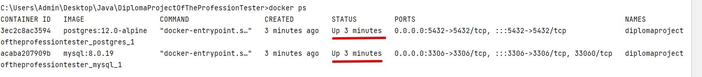

# QA Engineer Diploma  

# Quality Assurance Engineer Diploma project

Diploma project represents a complex web service testing automatization, which interacts with Bank's database & API.

## Documentation

[Diploma task](https://github.com/netology-code/qa-diploma.git)

[Internet bank tour purchase service (Web form) Test automation plan](doc/Plan.md)

[Test report](doc/Report.md)

[Test Automation report](doc/Summary.md)

## Preconditions

Before launch you need to fullfill next requirments.
*Requerments:*
1. [Clone](https://github.com/Alexander-Berg/QADiploma.git) git repository  or use VCS Git integrated in IntelliJ IDEA
2. [Install](https://docs.docker.com/get-docker/) and launch Docker Desktop. Installation process depends on operating system.
Additional guides how to install docker [here](https://github.com/netology-code/aqa-homeworks/blob/master/docker/installation.md)
3. Open project in IntelliJ IDEA

### Application launch

1. Launch requered databases (MySQL or PostgreSQL), and NodeJS. Launch parameters in file `docker-compose.yml`.
2.Write Launch command in terminal:
> * `docker-compose up -d`

2. In new terminal tab execute command depending on database:

> * `java -Dspring.datasource.url=jdbc:mysql://localhost:3306/app -jar ./artifacts/aqa-shop.jar` - for MySQL
> * `java -Dspring.datasource.url=jdbc:postgresql://localhost:5432/app -jar ./artifacts/aqa-shop.jar` - for PostgreSQL

3. Verification that containers works:

> * `docker ps`

> 

4. Application must start on this adress:

> * `http://localhost:8080/`
 
## Autotests run

1. To launch autotests with "MySQL",open new tab of terminal and execute next command:
> * `gradlew test -Dselenide.headless=true -Durlbd=jdbc:mysql://localhost:3306/app --info`

2.  To launch autotests with "PostgreSQL",open new tab of terminal and execute next command:
> * `gradlew test -Dselenide.headless=true -Durlbd=jdbc:postgresql://localhost:5432/app --info`

## Test report

1. To see test reports with "Allure", execute next commands :
> * `gradlew allureReport`
> * `gradlew allureServe`

## Docker containers shutdown
1. To shutdown docker containers "Docker-Compose", execute next command in terminal: 

> * `docker-compose down`

## Command line running services shutdown
1. To shutdown  command line running services, press Ctrl + C in all open terminal tabs

## AllureReport

# My Other Example Projects:
1. My Personal Site [Mobile Automation](https://github.com/Alexander-Berg/MyPersonalSiteMobileTestAutomation.git)
1. My Personal Site [Web Automation](https://github.com/Alexander-Berg/MyPersonalSiteMobileTestAutomation.git)
2. Also my [Git Hub Mainpage](https://github.com/Alexander-Berg) includes more useful Quality assurance information and my personal projects

