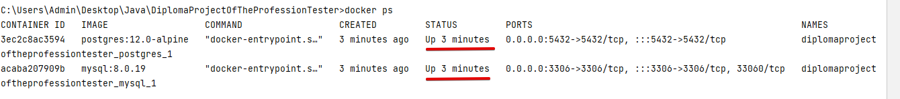

# DiplomaProjectOfTheProfessionTester 

# Дипломный проект профессии «Тестировщик»

Дипломный проект представляет собой автоматизацию тестирования комплексного сервиса, взаимодействующего с СУБД и API
Банка.

## Документация

[Дипломное задание](https://github.com/netology-code/qa-diploma.git)

[План автоматизации тестирования веб-формы сервиса покупки туров интернет-банка](doc/Plan.md)

[Отчёт о проведенном тестировании](doc/Report.md)

[Отчёт о проведённой автоматизации](doc/Summary.md)

## Запуск приложения

Перед запуском необходимо выполнить следующие предусловия. Если у вас уже есть необходимое ПО, то понадобится только п.1 и запуск Docker.

*Предусловия:*
1. Необходимо склонировать репозиторий или скачать архив по [ссылке](https://github.com/Aleks4404/DiplomaProjectOfTheProfessionTester.git). Или воспользоваться VCS Git, встроенной в
   IntelliJ IDEA.
2. Установить и запустить Docker Desktop. Это можно сделать [здесь](https://docs.docker.com/get-docker/) в зависимости от операционной системы. Дополнительные инструкции по установке Docker [ссылке](https://github.com/netology-code/aqa-homeworks/blob/master/docker/installation.md)
3. Открыть проект в IntelliJ IDEA

### Запуск

1. Запустить необходимые базы данных (MySQL и PostgreSQL), а также NodeJS. Параметры для запуска хранятся в
   файле `docker-compose.yml`. Для запуска необходимо ввести в терминале команду:

> * `docker-compose up -d`

2. В новой вкладке терминала ввести следующую команду в зависимости от базы данных

> * `java -Dspring.datasource.url=jdbc:mysql://localhost:3306/app -jar ./artifacts/aqa-shop.jar` - для MySQL
> * `java -Dspring.datasource.url=jdbc:postgresql://localhost:5432/app -jar ./artifacts/aqa-shop.jar` - для PostgreSQL

3. Проверка работающих контейнеров:

> * `docker ps`

> 

4. Приложение должно запуститься по адресу

> * `http://localhost:8080/`
 
## Запуск автотестов

1. Для запуска автотестов с "MySQL",  необходимо открыть новую вкладку терминала и ввести следующую команду:
> * `gradlew test -Dselenide.headless=true -Durlbd=jdbc:mysql://localhost:3306/app --info`

2. Для запуска автотестов с "PostgreSQL",  необходимо открыть новую вкладку терминала и ввести следующую команду:
> * `gradlew test -Dselenide.headless=true -Durlbd=jdbc:postgresql://localhost:5432/app --info`

## Запуск отчета тестирования

1. Для запуска и просмотра отчета по результатам тестирования, с помощью "Allure", выполнить по очереди команды:
> * `gradlew allureReport`
> * `gradlew allureServe`

## Завершения работы Sut 

1. Для завершения работы SUT, необходимо в терминале, где был запущен SUT, ввести команду:
> * `Ctrl+C`

## Остановка и удаление контейнера
1. Для остановки работы контейнеров "Docker-Compose", необходимо ввести в терминал следующую команду: 

> * `docker-compose down`