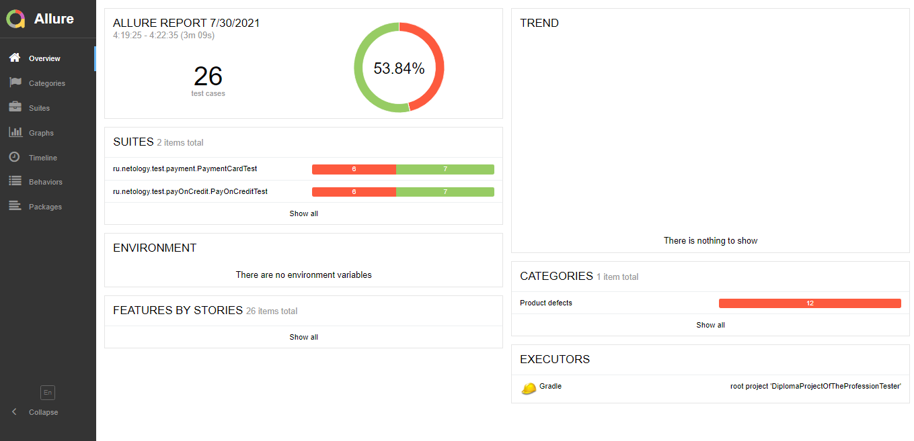
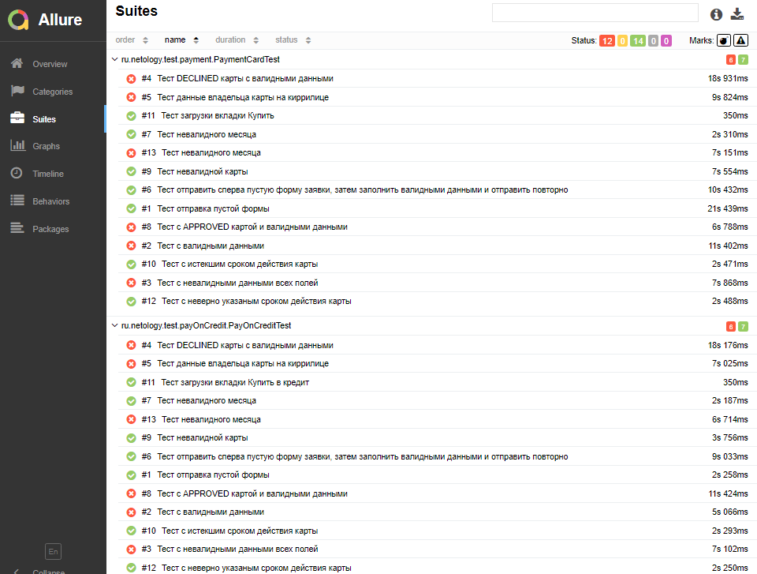
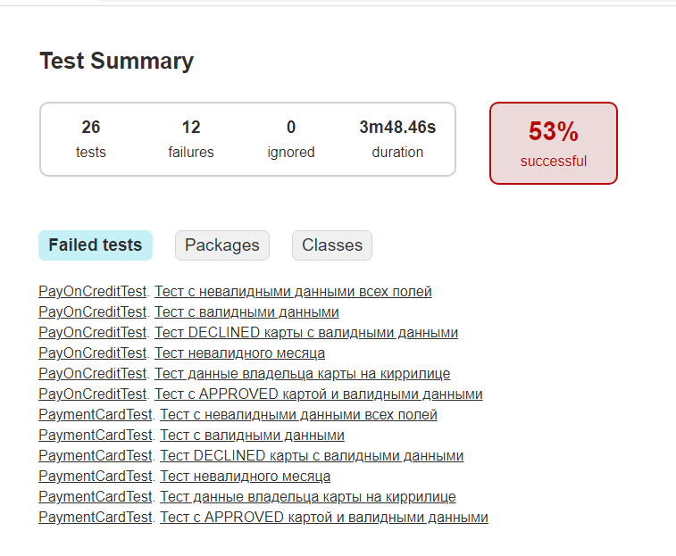
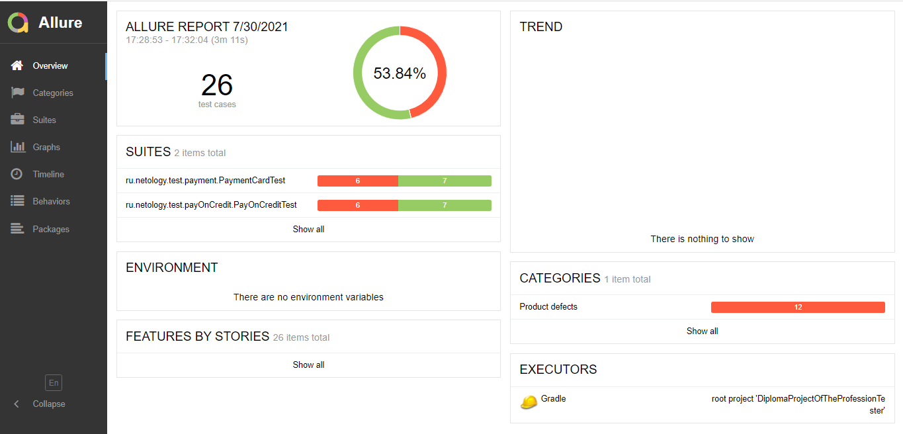
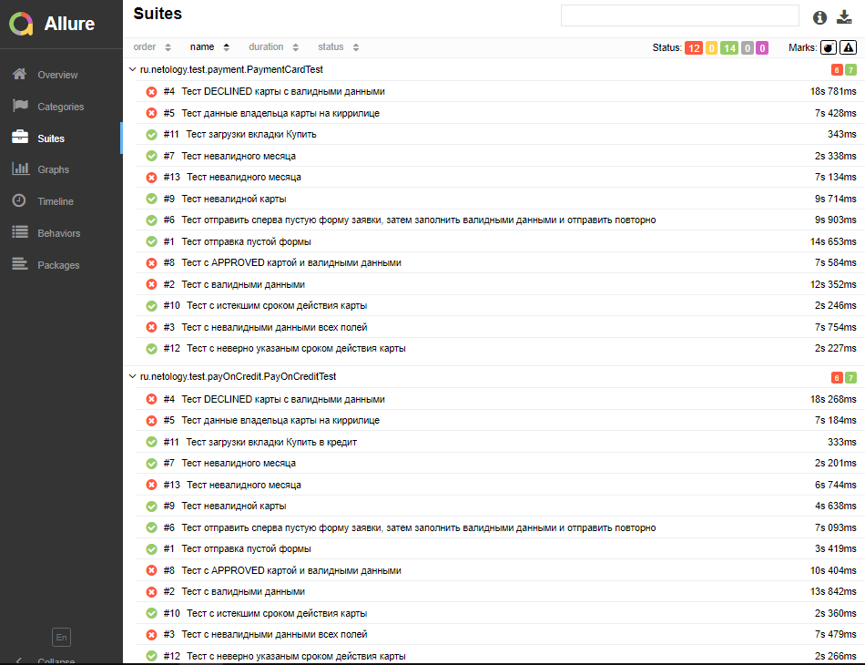

# Отчёт о проведённом тестировании

## Краткое описание
> * Автоматизировано тестирование комплексного сервиса покупки тура, взаимодействующего с СУБД и API Банка.

## Общее количество тест кейсов: 
> * Общее количество тест-кейсов для обеих СУБД - 26 шт

## Статистика успешных/неуспешных кейсов

### При подключении к БД MySQL
> * Успешных кейсов 53.84% (14 кейсов)
> * Неуспешных кейсов 46.16% (12 кейсов)

   
Report

  

  

### При подключении к БД PostgreSQL
> * Успешных кейсов 53.84% (14 кейсов)
> * Неуспешных кейсов 46.16% (12 кейсов)

   
Report

## Общие рекомендации
1. Исправить орфографические ошибки ([Ошибка в слове Марракеш](https://github.com/Aleks4404/DiplomaProjectOfTheProfessionTester/issues/1))
2. Исправить визуальные ошибки ([Ошибка в названии вкладки](https://github.com/Aleks4404/DiplomaProjectOfTheProfessionTester/issues/5)) 
3. Исправить цвет кнопки "Купить" и "Купить в кредит", чтобы при нажатии они меняли цвет ([Красный - активная вкладка, белый - неактивная](https://github.com/Aleks4404/DiplomaProjectOfTheProfessionTester/issues/4)).
3. Исправить дефекты связанные с неверными сообщениями об ошибках.
4. Для поля "Владелец" ввести ограничение на вводимые символы - только английские буквы, нечувствительные к регистру.
5. Сделать кнопку "Продолжить" неактивной, если есть пустые и/или неправильно заполненные поля.

**Полный список найденных дефектов находится в [Issues](https://github.com/Aleks4404/DiplomaProjectOfTheProfessionTester/issues)**